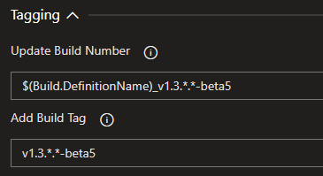

# Introduction
Assembly Info is an extension for Azure DevOps that populates assembly information metadata from a build pipeline.

The extension contains 2 tasks: - one which targets .Net Framework projects and another task which targets .Net Core / .Net Standard projects.

## How to use the build task
1. Create or edit a build definition.
2. Click **Add build step...** and add the **Assembly Info** task from the Build category (see below for the yaml).  
3. Move the **Assembly Info** task to the desired position ensuring it precedes the build task.  

   

4. Configure the task by providing values for the attributes.  For versioning examples please see the [wiki page](https://github.com/BMuuN/vsts-assemblyinfo-task/wiki/Versioning).
5. The result, an assembly with the manifest data applied:  

  

If you prefer to manage your build definitions via code then below is a sample of a yaml configuration for a Net Core pipeline.  For detailed information on the task parameters please see the [Task Parameters & Build Yaml](https://github.com/BMuuN/vsts-assemblyinfo-task/wiki/Task-Parameters-&-Build-Yaml) wiki page.

```yaml
variables:
  appVersion: '1.2.*-beta5'

steps:
- task: Assembly-Info-NetCore@3
  displayName: 'Set Assembly Metadata'
  inputs:
    Path: '$(Build.SourcesDirectory)'
    FileNames: '**/*.csproj'
    InsertAttributes: true
    FileEncoding: 'utf-8'
    WriteBOM: true
    FailOnWarning: true
    Authors: 'Bleddyn Richards'
    Company: 'Example Ltd'
    Copyright: 'Copyright © $(date:YYYY) Example Ltd'
    PackageVersion: '$(appVersion)'
    UpdateBuildNumber: '$(Build.DefinitionName)_v$(appVersion)'
    AddBuildTag: 'v$(appVersion)'
```

## Considerations
- The task will only update files listed in the **Source Files** field.
- The task can update .Net Framework *AssemblyInfo* files and .Net Core / .Net Standard project files (*.csproj* or *.vbproj*).
- If no value is specified for a field that field will be ignored and the default value in the source file will be used.

## Output Variables
All version numbers used within the task are outputted as variables to be used in subsequent tasks within your build pipeline.  The following output variables are created by the Assembly Info task:

```
AssemblyInfo.Version
AssemblyInfo.FileVersion
AssemblyInfo.InformationalVersion
AssemblyInfo.PackageVersion
```

> Please note `AssemblyInfo.PackageVersion` is only available from v2 of the .Net Core & .Net Standard task.

## Build Tagging
You can add a tag to your build or update the build name by setting the following "Tagging" task parameters:



Both fields accept [date and time formats](https://github.com/BMuuN/vsts-assemblyinfo-task/wiki/Date-&-Time-Format) including any flavour of [versioning](https://github.com/BMuuN/vsts-assemblyinfo-task/wiki/Versioning).  Check the wiki for more information on [Build Tagging](https://github.com/BMuuN/vsts-assemblyinfo-task/wiki/Build-Tagging).

## Telemetry
The task collects anonymous usage data to help improve the product. If you do not wish to send usage data you can disable Telemetry by checking the "Disable Telemetry" parameter or setting the yaml property: `DisableTelemetry: true`

> If you are running the task from an on-premise environment and the task is not completing in a siffcient amount of time please disable Telemetry.

## Help and Support
For detailed instructions on how to configure the extension please see the [wiki](https://github.com/BMuuN/vsts-assemblyinfo-task/wiki).

## Contributions
We welcome all contributions whether it's logging bugs, creating suggestions or submitting pull requests.  
If you wish to contributions to this project head on over to our [GitHub](https://github.com/BMuuN/vsts-assemblyinfo-task) page.

## Release Notes
See the [release notes](https://github.com/BMuuN/vsts-assemblyinfo-task/blob/master/ReleaseNotes.md) for all changes included in each release.
