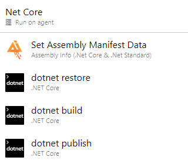
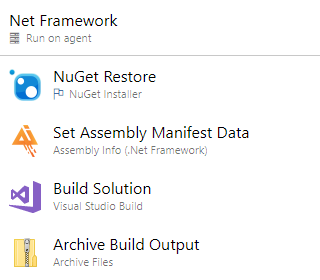
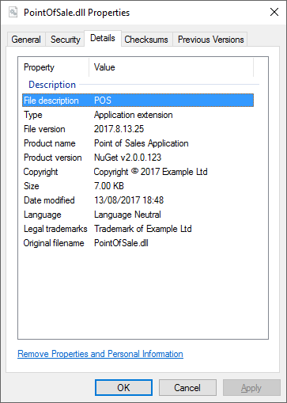

# Assembly Info
Assembly Info is an extension for Azure DevOps that populates assembly information metadata from a build pipeline.

The extension contains 2 tasks: - one which targets Net Framework projects and another task which targets Net Core / Net Standard projects.

## How to use the build task
1. Create or edit a build definition.
2. Click **Add build step...** and add the **Assembly Info** task from the Build category.  
3. Move the **Assembly Info** task to the desired position ensuring it precedes the build task.  

   

4. Configure the task by providing values for the attributes.  For versioning examples please see the [wiki page](https://github.com/BMuuN/vsts-assemblyinfo-task/wiki/Versioning).
5. The result, an assembly with the manifest data applied:  

  

## Considerations
- The task will only update files listed in the **Source Files** field.
- The task can update project *AssemblyInfo* files and .Net Core / .Net Standard project files *.csproj*.
- If no value is specified for a field that field will be ignored and the default value in the source file will be used.

## Help and Support
For detailed instructions on how to configure the extension please see the [wiki](https://github.com/BMuuN/vsts-assemblyinfo-task/wiki).

### Upgrade to Version 2
With the release of version 2 the extension has been re-written from the ground up using Node.js and includes a number of breaking changes.  Please see the [wiki](https://github.com/BMuuN/vsts-assemblyinfo-task/wiki/Upgrade-v1-to-v2) for details on the upgrade.

## Contributions
We welcome all contributions whether it's logging bugs, creating suggestions or submitting pull requests.  
If you wish to contributions to this project head on over to our [GitHub](https://github.com/BMuuN/vsts-assemblyinfo-task) page.

### Release Notes
See the [release notes](https://github.com/BMuuN/vsts-assemblyinfo-task/blob/master/ReleaseNotes.md) for all changes included in each release.