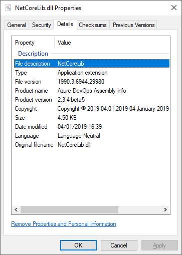

# Assembly Info
Assembly Info is an extension for Team Foundation Server / Team Services that sets assembly information from a build.

## Details
The extension will recursively search the specified **Source Folder** for all files listed in the **Source Files** field and set the manifest data. This will result in assembly files containing common company or product information.

Values for the following attributes can be set from the extension:  

| Field | Attribute | Function |
|-------|-----------|----------|
| Title | AssemblyTitle | Provides a friendly name for the assembly. |
| Product | AssemblyProduct | Provides the product information for the assembly. |
| Description | AssemblyDescription | Provides a short description that summarizes the nature and purpose of the assembly. |
| Company | AssemblyCompany | Provides the company name for the assembly. |
| Copyright | AssemblyCopyright | Provide the assembly or product copyright information. |
| Trademark | AssemblyTrademark | Provides the assembly or product trademark information. |
| Culture | AssemblyCulture | Provides information on what culture the assembly supports. |
| Configuration | AssemblyConfiguration | Provides the build configuration for the assembly, such as debug or release. |
| Version Number | AssemblyVersion | Provides a assembly version for the application. |
| File Version Number | AssemblyFileVersion | Provides a file version for the application. |
| Informational Version | AssemblyInformationalVersion | Provides a text version for the application. |

### Considerations
- If no value is specified for a field that field will be ignored and the default value in the *AssemblyInfo.\** source file will be used.
- The task will recursively search the **Source Folder** for all files listed in the **Source Files** field.
- The task will only update files listed in the **Source Files** field.
- The task can update project *AssemblyInfo* files, *GlobalAssemblyInfo* files and .Net Core project files *.csproj*.

> For more information regarding assembly attributes please see the following [Microsoft Doc](https://docs.microsoft.com/en-us/dotnet/framework/app-domains/set-assembly-attributes)

## How to use the build task
### Configuration
1. Create or edit a build definition.
2. Click **Add build step...** and add the **Assembly Info** task from the Build category.
3. Move the **Assembly Info** task to the desired position ensuring it precedes the Visual Studio Build task.  

  

4. Configure the task by providing values for the attributes mentioned in the above table.  
> Ensure you specify the file names you wish to populate within the **Source Files** field: -  
> For .Net Framework specify files such as: *AssemblyInfo.cs, AssemblyInfo.vb, GlobalInfo.cs*  
> For .Net Core specify the project filename: *NetCore.csproj*  

  

5. The result, an assembly with the manifest data applied:  

  

### Version Number
A version number must be a numeric value in the format `digit.digit.digit.digit`.  
This will support  *major.minor.build.revision* versioning:  
```
1.0.0.0
2016.12.31.1
```
To achieve the best result edit a build definition then select the **General** tab and set the **Build number format** to:
```
$(Build.DefinitionName)_$(date:yyyy).$(date:MM).$(date:dd)$(rev:.r)
```
Now click the **Tasks** tab, select the Assembly Info task and set the **Version Number** to:
```
$(Build.BuildNumber)
```
This approach ensures:
- The version number is in the correct format.
- The version number is determined by the build and not the task.
- Enables us to associate assemblies to a specific build.

### Copyright
The copyright field supports date and time formats. You can set the date and time in the copyright field by using one of the following examples:
```
Copyright © $(date:yyyy)  
Copyright © $(date:dd MM yyyy)  
Copyright © $(date:M.d.yyyy)  
Copyright © $(date:dd MMMM yyyy HH:mm tt)
```
> For additional date & time formats please see the following [Microsoft Doc](https://docs.microsoft.com/en-us/dotnet/standard/base-types/custom-date-and-time-format-strings).

## Contributions
We welcome all contributions whether it's logging bugs, creating suggestions or submitting pull requests.  
If you wish to contributions to this project head on over to our [GitHub](https://github.com/BMuuN/vsts-assemblyinfo-task) page.

### Community
We thank the following contributors for their time and effort with this project: 
- [roryza](https://github.com/roryza)
- [richardctrimble](https://github.com/richardctrimble)

### Release Notes
See the [release notes](https://github.com/BMuuN/vsts-assemblyinfo-task/ReleaseNotes.md) for all changes included in each release.